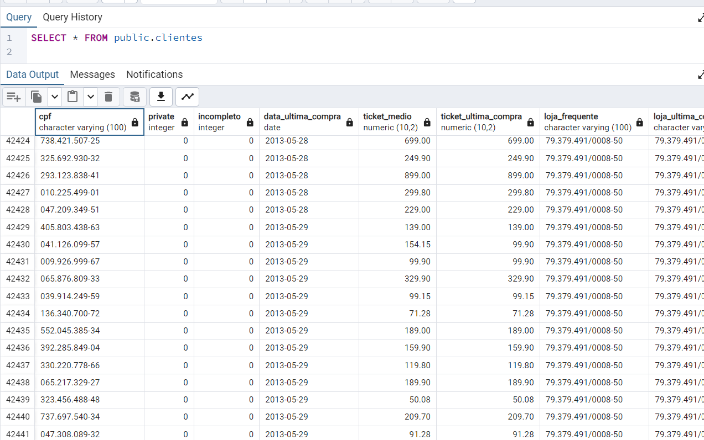

<h1>Neoway- Teste de Aprendizagem</h1>

<p>Este projeto cria e realiza o armazenamento de dados de um arquivo txt para uma tabela de banco de dados.<p>

## Sumário
1. [Visão Geral](#visão-geral)
2. [Pré-requisitos](#pré-requisitos)
3. [Como Utilizar](#como-utilizar)
4. [Banco de dados](#banco-de-dados)
5. [Pontos de Melhoria](#pontos-de-melhoria)


## Visão Geral

O programa conecta ao banco de dados PostgreSQL, cria uma tabela utilizando os dados de um arquivo txt, realiza o tratamento necessário para o arquivo que consiga suprir a demanda e prosseguir com sua criação no banco de dados.<br><br>


## Pré-requisitos
Antes de executar o projeto, certifique-se de que você tenha os seguintes pré-requisitos instalados em seu sistema:

**Go:** Certifique-se de ter o Go instalado.<br>
**PostgreSQL:** O banco de dados PostgreSQL deve estar instalado e em execução.<br>
**Biblioteca:**  Necessário instalação da biblioteca para conectar no PostgreSQL:
```
go get github.com/lib/pq 
```
## Como utilizar

1. Após os pré-requisitos serem realizados, salve o arquivo em seu computador.
2. Preencha as informações conforme o registro criado para o seu banco de dados no PostgreeSQL
```
"user= seu-usuário dbname= nome-do-seu-db password= senha sslmode= modo-de-conexão"
```
3. Após isso execute o programa no console
```+++++++++++++++++++++++++++++++++++++++++
go run main.go
```
## Banco de dados

1. Após o progrma criar e enviar os dados necessários para o PostgreSQL, realizei a criação de duas funções para realizar as validações dos campos de CPFs e CNPJs. <br>
**Funções de validação SQL:** 'Função_validação_cnpj.sql' e 'Função_validação_cpf.sql'

2. Com a função criada, criei as três colunas para informar se os campos que informam CPFs e o CNPJs são validos e criei o link entre a função e as colunas de validação. <br>
**Update e assignação das funções SQL:** 'Update_validação.sql'

3. No ultimo tratamento com os dados criei um update para realizar higienização dos dados no SQL, onde remove espaçamentos. <br>
**Tratamento de espaços**: 'Higienização_ dados.sql'

## Pontos de Melhoria

Alguns pontos que eu vejo de melhoria no projeto criado.
1. **Não Adaptabilidade** O programa não se adapta a outros arquivos, com novas informações. Nele eu informo as colunas e limito a quantidade de colunas para conseguir alocar as informações de acordo com cada coluna. Caso eu tenha o mesmo tipo de arquivo só que com 80 colunas meu código terá que ser adaptado para isso.
2. **Senha de banco de dados** Devido o compartilhamento do programa, visando a segurança, o ideal seria ter a senha ocultada ou não permitir que ela seja visivel para outros usuários


    